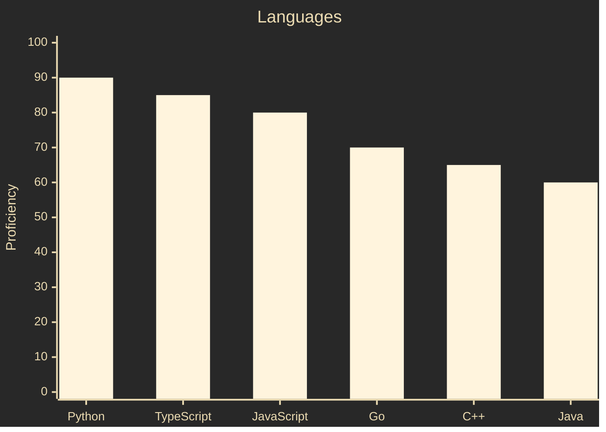
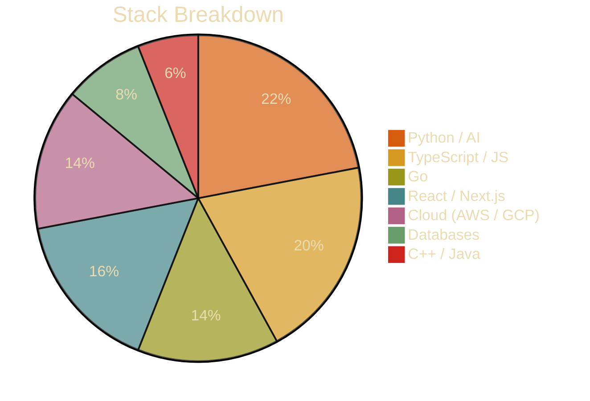

 

---

## 🐾 About Me

Hey, I'm **Tony** — a Software Engineering student at **UC Irvine** who loves building clean, scalable systems and shipping fast under hackathon constraints.

- 📍 Irvine, CA
- 🎓 B.S. Software Engineering @ UC Irvine
- 💡 Interested in backend systems, AI tooling, and developer experience
- 🐕 Certified corgi enthusiast

---

## 🏆 Stats

---

## 🐾 Tech Stack

---

## 🦴 Hackathons

<!-- DEVPOST:START -->
_[View projects on Devpost](https://devpost.com/thinhtn3)_
<!-- DEVPOST:END -->

---

## 🐕 Connect

